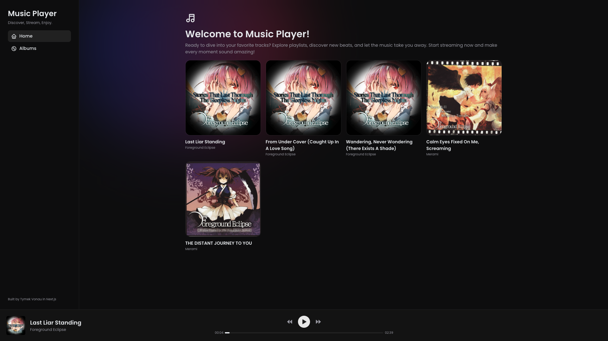
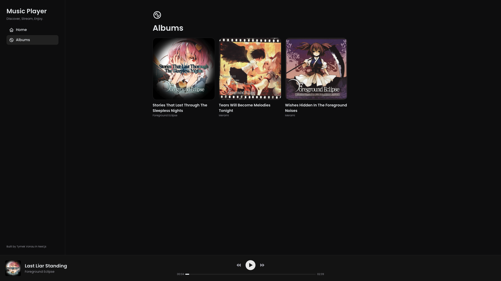
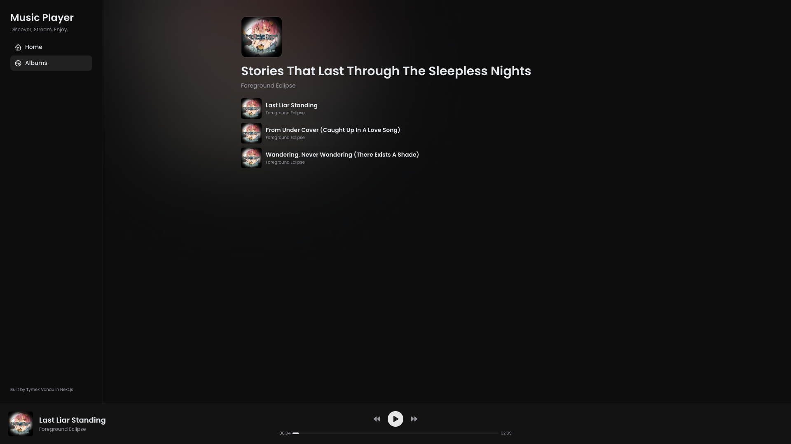

# Music Player


This is a simple web-based music player app. It currently does not have a proper backend with a database and uses hard-coded music from `./public/media` instead. The app has support for displaying album views.





## Running in development mode
```bash
npm i
npm run dev
```
## Running in production mode
```bash
docker compose up --build
```